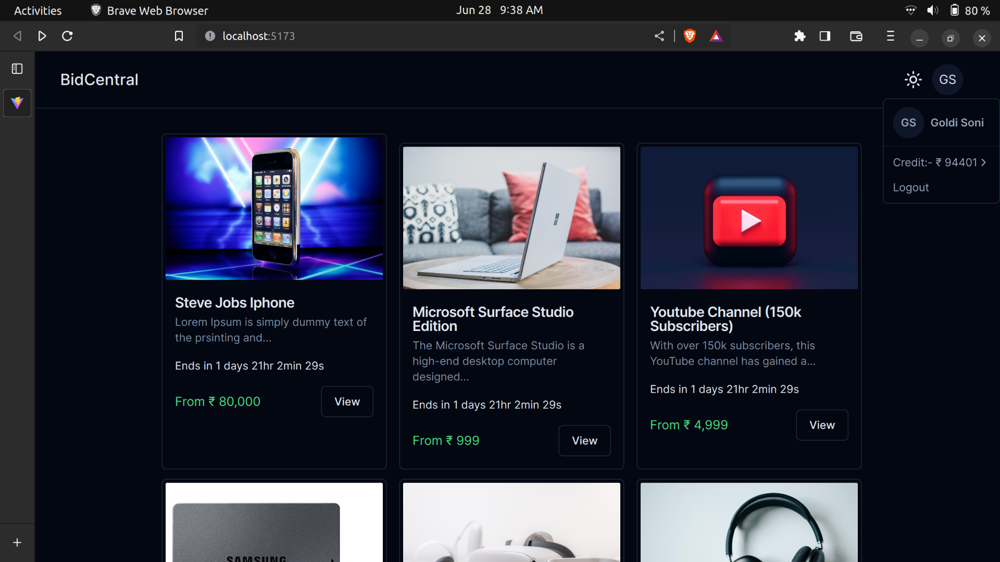
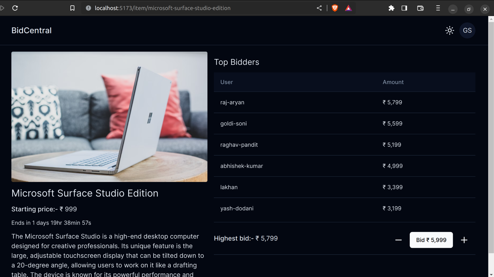

# Ebidding

A E-bidding system




## Development setup

### Install
```
npm install
```
### Run dev server

#### 1. Run server:-
```
npm run dev -w server
```
#### 2. Run client:-
```
npm run dev -w client
```

## Features:-

### User

- [X] User Login.
- [X] User Register.
- [X] Show All item in home page.
- [X] Users add credit to their account.
- [X] Users can make a bid in real-time (uses Socket.io).
- [X] Show the name and image of Top bidder.

### Admin

- [X] Add items from admin panel.
- [X] Show all items and bids.
